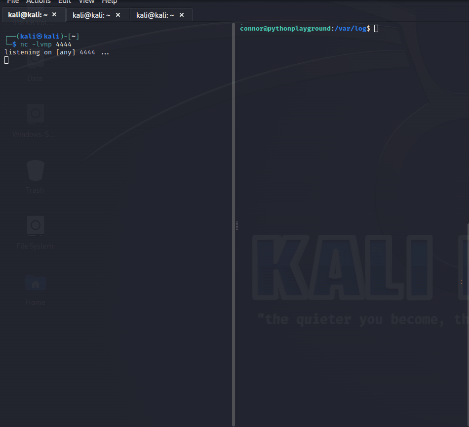
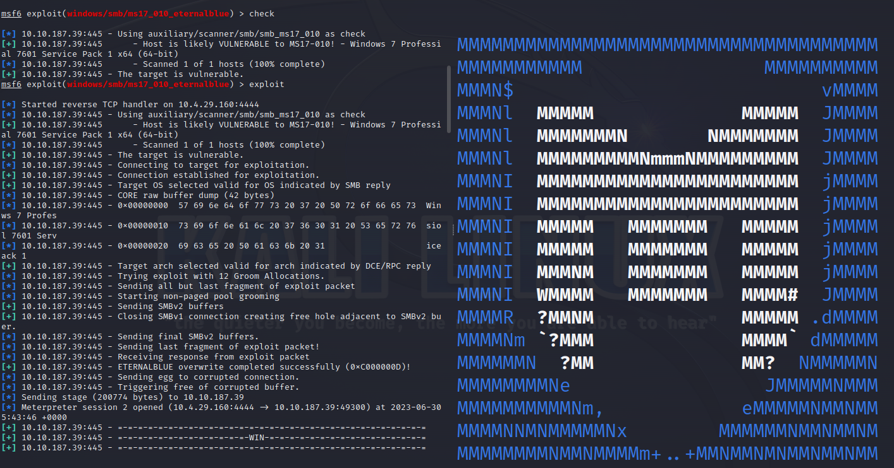

<h1 align="center">Hi there, I'm <a href="https://www.blackcater.win/" target="_blank">OffensiveDroid</a> </h1>

Welcome on my Github profile!

🛡️ I am a CyberSecurity Student learning about Offensive Go  
👾 I am Interested in CTFs  
🔥 I mostly like Python, Go, WebHacking, Reverse Engineering  
📱 Feel free to reach out to me! 

###  Social Platforms 

   &nbsp;&nbsp;
&nbsp;&nbsp;
&nbsp;&nbsp;
&nbsp;&nbsp;
 &nbsp;&nbsp;
 

###  Tools and Technologies

  <!-- For more icons please follow  https://github.com/MikeCodesDotNET/ColoredBadges -->
      
  
  
  
  
  
  
  
  
  
  
  
  
  

###  TryHackme Profile

| Github Stats | Top Languages |
| --- | --- |
|  |  |

 
 
##    IAM ROOT~

   
   

   

   
   

 

<h2 align="center">💻 Eat, Sleep, Hack - REPEAT!</h2>

🎀 Contributions (<a href="https://guides.github.com/introduction/flow" title="GitHub flow">GitHub Flow</a>), 🔥 issues, and 🥮 feature requests are most welcome!

🖤 If you like my projects, Give them ⭐ and Share it!

